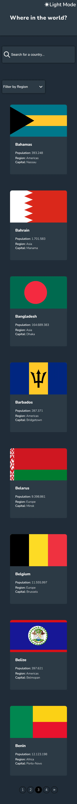

# Frontend Mentor Project - REST Countries API with color theme switcher

Repositorio con el código solución al proyecto [REST Countries API with color theme switcher](https://www.frontendmentor.io/challenges/rest-countries-api-with-color-theme-switcher-5cacc469fec04111f7b848ca)

El challenge consiste en realizar todo lo siguiente:

## The challenge

Users should be able to:

- See all countries from the API on the homepage
- Search for a country using an `input` field
- Filter countries by region
- Click on a country to see more detailed information on a separate page
- Click through to the border countries on the detail page
- Toggle the color scheme between light and dark mode _(optional)_

He realizado todo lo anterior. Muestro todos los países en la homepage pero he utilizado un **paginator** creado usando React y Styled Components el cual muestra 8 países por hoja.

A continuación muestro screenshots del proyecto.

## Screenshots

#### 1.Dark Theme

##### 1.1. Home Page

###### 1.1.1. Desktop

###### 1.1.2. Mobile

##### 1.2. Country Page

###### 1.2.1. Desktop

###### 1.2.2. Mobile

#### 2.Light Theme

##### 2.1. Home Page

###### 2.1.1. Desktop

###### 2.1.2. Mobile

##### 2.2. Country Page

###### 2.2.1. Desktop

###### 2.2.2. Mobile

